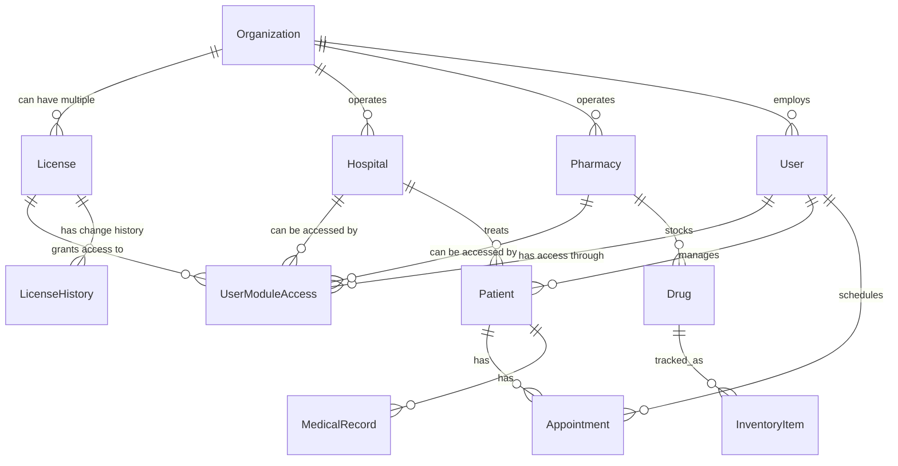

# Healthcare Management System - Database Schema Analysis

## Overview

This document provides a comprehensive analysis of the database relationships and table structures for the Healthcare Management System (HK Management). The system supports multiple organizations (hospitals and pharmacies) with flexible licensing and user management.

## Core Entities & Relationships

### 1. License Entity (Modular Control)
The license system supports modular purchasing where organizations can buy pharmacy, hospital, or both modules independently.

```typescript
interface License {
  id: string;                    // Primary key
  license_key: string;           // Unique license key (e.g., "TRIAL-HK2024XY-Z9M3")
  organization_id: string;       // Foreign key to Organization
  module_type: string;           // 'PHARMACY', 'HOSPITAL', 'TRIAL'
  license_tier: string;          // 'BASIC', 'PROFESSIONAL', 'ENTERPRISE', 'TRIAL'
  is_active: boolean;            // License status
  issued_date: string;           // When license was issued
  expiry_date: string | null;    // NULL for perpetual licenses
  max_users: number | null;      // User limit for this module (NULL = unlimited)
  max_facilities: number | null; // Facility limit (NULL = unlimited)
  features: string[];            // JSON array of allowed features for this module
  billing_cycle: string;         // 'MONTHLY', 'ANNUAL', 'PERPETUAL', 'TRIAL'
  auto_renew: boolean;           // Auto renewal flag
  created_at: string;
  updated_at: string;
  metadata: Record<string, any>; // Additional license-specific data
}
```

**Modular License Types:**
- **PHARMACY**: Pharmacy operations only
  - Basic: POS, basic inventory, basic reporting
  - Professional: + Advanced inventory, prescription management, supplier management
  - Enterprise: + Multi-location, advanced analytics, API access
- **HOSPITAL**: Hospital operations only
  - Basic: Patient management, appointments, basic billing
  - Professional: + Medical records, lab integration, advanced scheduling
  - Enterprise: + Multi-department, advanced reporting, EMR integration
- **TRIAL**: Full access to both modules, 30-day limit, max 3 users

### 2. Organization Entity (License-Agnostic)
Organizations represent business entities that can have multiple modular licenses.

```typescript
interface Organization {
  id: string;                    // Primary key
  name: string;                  // Organization name
  registration_number: string;   // Official business registration
  business_type: string;         // 'HOSPITAL', 'PHARMACY', 'CLINIC', 'HEALTHCARE_GROUP'
  address: string;
  city: string;
  country: string;
  phone: string;
  email: string;
  contact_person: string;
  billing_address: string;       // For license billing
  tax_number: string;            // Tax identification
  is_active: boolean;
  settings: Record<string, any>; // Organization-specific settings
  created_at: string;
  updated_at: string;
}
```

**License-Organization Relationship:**
- Organizations can have multiple licenses (one per module/tier combination)
- Each license can be purchased, upgraded, or expired independently
- Billing is handled per license, not per organization

### 3. User Entity (Module-Aware Access)
Users belong to organizations and their access is determined by the organization's active licenses.

```typescript
interface User {
  id: string;                    // Primary key
  organization_id: string;       // Foreign key to Organization
  phone: string;                 // Unique phone number for authentication
  password_hash: string;         // Encrypted password
  first_name: string;
  last_name: string;
  primary_role: UserRole;        // Primary role across all modules
  department: string | null;     // Department within organization
  employee_id: string | null;    // Internal employee identifier
  professional_license: string | null; // Medical/pharmacy license number
  is_active: boolean;
  last_login: string | null;
  created_at: string;
  updated_at: string;
  metadata: Record<string, any>; // Additional user data
}
```

**Module-Specific User Access:**
```typescript
interface UserModuleAccess {
  id: string;                    // Primary key
  user_id: string;              // Foreign key to User
  license_id: string;           // Foreign key to License
  module_type: string;          // 'PHARMACY', 'HOSPITAL'
  role: UserRole;               // Role within this module
  permissions: Permission[];     // JSON array of module-specific permissions
  facility_access: string[];    // JSON array of facility IDs user can access
  is_active: boolean;
  granted_at: string;
  created_at: string;
  updated_at: string;
}
```

**Enhanced User Roles:**
- **admin**: Full system access within organization
- **hospital_admin**: Hospital module admin
- **pharmacy_admin**: Pharmacy module admin
- **doctor**: Patient care, prescriptions, medical records
- **nurse**: Patient care, limited medical records
- **pharmacist**: Prescription dispensing, inventory management
- **pharmacy_tech**: Limited pharmacy operations
- **receptionist**: Patient registration, appointments
- **lab_technician**: Lab results, sample management
- **cashier**: Billing and payments
- **inventory_manager**: Stock management across modules

### 4. Hospital Entity (Hospital-Specific Data)
Hospitals represent medical facilities within organizations.

```typescript
interface Hospital {
  id: string;                    // Primary key
  organization_id: string;       // Foreign key to Organization
  name: string;                  // Hospital name (can differ from org name)
  hospital_code: string;         // Unique identifier
  type: string;                  // 'GENERAL', 'SPECIALTY', 'CLINIC', 'EMERGENCY'
  bed_capacity: number;
  departments: string[];         // JSON array of departments
  services_offered: string[];    // JSON array of medical services
  accreditation_info: Record<string, any>; // Accreditation details
  emergency_contact: string;
  is_active: boolean;
  created_at: string;
  updated_at: string;
}
```

### 5. Pharmacy Entity (Pharmacy-Specific Data)
Pharmacies represent pharmaceutical facilities within organizations.

```typescript
interface Pharmacy {
  id: string;                    // Primary key
  organization_id: string;       // Foreign key to Organization
  name: string;                  // Pharmacy name
  pharmacy_code: string;         // Unique identifier
  license_number: string;        // Official pharmacy license
  type: string;                  // 'RETAIL', 'HOSPITAL', 'SPECIALTY', 'ONLINE'
  services: string[];            // JSON array of services offered
  operating_hours: Record<string, any>; // Store hours by day
  accepts_insurance: boolean;
  delivery_available: boolean;
  is_24_hours: boolean;
  is_active: boolean;
  created_at: string;
  updated_at: string;
}
```

### 6. License Management Scenarios

**Scenario 1: Pharmacy-Only Organization**
```
Organization: "City Pharmacy"
├── License: PHARMACY-BASIC (Active)
├── Users: 2 pharmacists, 1 cashier
└── Facilities: 1 pharmacy
```

**Scenario 2: Hospital-Only Organization** 
```
Organization: "General Hospital"
├── License: HOSPITAL-PROFESSIONAL (Active)
├── Users: 5 doctors, 10 nurses, 2 receptionists
└── Facilities: 1 hospital
```

**Scenario 3: Dual-Module Organization**
```
Organization: "Healthcare Group"
├── License: PHARMACY-ENTERPRISE (Active)
├── License: HOSPITAL-PROFESSIONAL (Active)
├── Users: Mixed roles across both modules
└── Facilities: 3 hospitals, 2 pharmacies
```

**Scenario 4: Expanding Organization**
```
Organization: "Community Clinic"
├── License: HOSPITAL-BASIC (Active since 2024)
├── License: PHARMACY-BASIC (Added in 2025)
├── Users: Existing hospital staff + new pharmacy staff
└── Facilities: 1 clinic with added pharmacy wing
```

### 7. License Upgrade/Downgrade Handling

```typescript
interface LicenseHistory {
  id: string;                    // Primary key
  license_id: string;           // Foreign key to License
  previous_tier: string;        // Previous license tier
  new_tier: string;             // New license tier
  change_type: string;          // 'UPGRADE', 'DOWNGRADE', 'RENEWAL', 'SUSPENSION'
  change_reason: string;        // Reason for change
  effective_date: string;       // When change takes effect
  changed_by: string;           // User who made the change
  billing_impact: Record<string, any>; // Billing adjustments
  created_at: string;
}
```

## Database Relationships



## Key Design Principles

### 1. Modular License System
- **Multiple Licenses per Organization**: Organizations can purchase pharmacy, hospital, or both modules independently
- **Flexible Expansion**: Start with one module and add others later without system migration
- **Independent Billing**: Each module has its own billing cycle and renewal schedule

### 2. Tiered Feature Access
- **Basic, Professional, Enterprise**: Different feature sets within each module
- **Scalable Pricing**: Organizations can upgrade tiers as they grow
- **Feature-Driven UI**: Interface adapts based on licensed features

### 2. Multi-Tenant Architecture
- **Organization Isolation**: Complete data separation between organizations
- **Module Independence**: Pharmacy and hospital modules can operate independently
- **Scalable Structure**: Supports growth from single-module to enterprise deployments

### 3. Granular Access Control
- **Module-Specific Roles**: Users can have different roles in pharmacy vs hospital modules
- **Facility-Level Permissions**: Control access to specific hospitals or pharmacies
- **License-Aware Authentication**: Access automatically adjusts based on active licenses

### 4. Flexible Facility Management
- **Hospital Chains**: Single organization can operate multiple hospitals
- **Pharmacy Networks**: Single organization can operate multiple pharmacies
- **Mixed Operations**: Single organization can operate both hospitals and pharmacies

## Implementation Considerations

### SQLite Schema

```sql
-- Core Tables (Updated for Modular Licensing)
CREATE TABLE organizations (
    id TEXT PRIMARY KEY,
    name TEXT NOT NULL,
    registration_number TEXT UNIQUE,
    business_type TEXT NOT NULL,
    address TEXT,
    city TEXT,
    country TEXT,
    phone TEXT,
    email TEXT,
    contact_person TEXT,
    billing_address TEXT,
    tax_number TEXT,
    is_active BOOLEAN DEFAULT TRUE,
    settings TEXT, -- JSON object
    created_at TEXT NOT NULL,
    updated_at TEXT
);

CREATE TABLE licenses (
    id TEXT PRIMARY KEY,
    license_key TEXT UNIQUE NOT NULL,
    organization_id TEXT NOT NULL,
    module_type TEXT NOT NULL, -- 'PHARMACY', 'HOSPITAL', 'TRIAL'
    license_tier TEXT NOT NULL, -- 'BASIC', 'PROFESSIONAL', 'ENTERPRISE', 'TRIAL'
    is_active BOOLEAN DEFAULT TRUE,
    issued_date TEXT NOT NULL,
    expiry_date TEXT,
    max_users INTEGER,
    max_facilities INTEGER,
    features TEXT, -- JSON array
    billing_cycle TEXT NOT NULL,
    auto_renew BOOLEAN DEFAULT FALSE,
    created_at TEXT NOT NULL,
    updated_at TEXT,
    metadata TEXT, -- JSON object
    FOREIGN KEY (organization_id) REFERENCES organizations(id)
);

CREATE TABLE users (
    id TEXT PRIMARY KEY,
    organization_id TEXT NOT NULL,
    phone TEXT UNIQUE NOT NULL,
    password_hash TEXT NOT NULL,
    first_name TEXT NOT NULL,
    last_name TEXT NOT NULL,
    primary_role TEXT NOT NULL,
    department TEXT,
    employee_id TEXT,
    professional_license TEXT,
    is_active BOOLEAN DEFAULT TRUE,
    last_login TEXT,
    created_at TEXT NOT NULL,
    updated_at TEXT,
    metadata TEXT, -- JSON object
    FOREIGN KEY (organization_id) REFERENCES organizations(id)
);

CREATE TABLE user_module_access (
    id TEXT PRIMARY KEY,
    user_id TEXT NOT NULL,
    license_id TEXT NOT NULL,
    module_type TEXT NOT NULL,
    role TEXT NOT NULL,
    permissions TEXT, -- JSON array
    facility_access TEXT, -- JSON array of facility IDs
    is_active BOOLEAN DEFAULT TRUE,
    granted_at TEXT NOT NULL,
    created_at TEXT NOT NULL,
    updated_at TEXT,
    FOREIGN KEY (user_id) REFERENCES users(id),
    FOREIGN KEY (license_id) REFERENCES licenses(id),
    UNIQUE(user_id, license_id)
);

CREATE TABLE hospitals (
    id TEXT PRIMARY KEY,
    organization_id TEXT NOT NULL,
    name TEXT NOT NULL,
    hospital_code TEXT UNIQUE NOT NULL,
    type TEXT NOT NULL,
    bed_capacity INTEGER DEFAULT 0,
    departments TEXT, -- JSON array
    services_offered TEXT, -- JSON array
    accreditation_info TEXT, -- JSON object
    emergency_contact TEXT,
    is_active BOOLEAN DEFAULT TRUE,
    created_at TEXT NOT NULL,
    updated_at TEXT,
    FOREIGN KEY (organization_id) REFERENCES organizations(id)
);

CREATE TABLE pharmacies (
    id TEXT PRIMARY KEY,
    organization_id TEXT NOT NULL,
    name TEXT NOT NULL,
    pharmacy_code TEXT UNIQUE NOT NULL,
    license_number TEXT UNIQUE NOT NULL,
    type TEXT NOT NULL,
    services TEXT, -- JSON array
    operating_hours TEXT, -- JSON object
    accepts_insurance BOOLEAN DEFAULT FALSE,
    delivery_available BOOLEAN DEFAULT FALSE,
    is_24_hours BOOLEAN DEFAULT FALSE,
    is_active BOOLEAN DEFAULT TRUE,
    created_at TEXT NOT NULL,
    updated_at TEXT,
    FOREIGN KEY (organization_id) REFERENCES organizations(id)
);

CREATE TABLE license_history (
    id TEXT PRIMARY KEY,
    license_id TEXT NOT NULL,
    previous_tier TEXT,
    new_tier TEXT NOT NULL,
    change_type TEXT NOT NULL, -- 'UPGRADE', 'DOWNGRADE', 'RENEWAL', 'SUSPENSION'
    change_reason TEXT,
    effective_date TEXT NOT NULL,
    changed_by TEXT,
    billing_impact TEXT, -- JSON object
    created_at TEXT NOT NULL,
    FOREIGN KEY (license_id) REFERENCES licenses(id)
);

-- Indexes for performance (Updated)
CREATE INDEX idx_licenses_org ON licenses(organization_id);
CREATE INDEX idx_licenses_key ON licenses(license_key);
CREATE INDEX idx_licenses_active ON licenses(is_active);
CREATE INDEX idx_licenses_module ON licenses(module_type);
CREATE INDEX idx_users_organization ON users(organization_id);
CREATE INDEX idx_users_phone ON users(phone);
CREATE INDEX idx_users_active ON users(is_active);
CREATE INDEX idx_user_module_access_user ON user_module_access(user_id);
CREATE INDEX idx_user_module_access_license ON user_module_access(license_id);
CREATE INDEX idx_user_module_access_module ON user_module_access(module_type);
CREATE INDEX idx_hospitals_org ON hospitals(organization_id);
CREATE INDEX idx_pharmacies_org ON pharmacies(organization_id);
CREATE INDEX idx_license_history_license ON license_history(license_id);
```

### Authentication Flow

1. **License Validation**: Validate license key and check expiry
2. **Organization Resolution**: Determine user's organization(s)
3. **User Authentication**: Verify credentials against organization
4. **Permission Loading**: Load user's roles and permissions
5. **Feature Enablement**: Enable UI features based on license type
6. **Session Management**: Maintain authenticated state with license validation

### Authorization Patterns

```typescript
// Modular license-based feature access
const hasModuleAccess = (organizationId: string, module: string): Promise<boolean> => {
  return db.query(
    'SELECT COUNT(*) as count FROM licenses WHERE organization_id = ? AND module_type = ? AND is_active = ? AND (expiry_date IS NULL OR expiry_date > ?)',
    [organizationId, module, true, new Date().toISOString()]
  ).then(result => result[0].count > 0);
};

// Feature access within a licensed module
const hasFeatureAccess = (organizationId: string, module: string, feature: string): Promise<boolean> => {
  return db.query(
    'SELECT features FROM licenses WHERE organization_id = ? AND module_type = ? AND is_active = ?',
    [organizationId, module, true]
  ).then(result => {
    if (result.length === 0) return false;
    const features = JSON.parse(result[0].features);
    return features.includes(feature);
  });
};

// User module access check
const hasUserModuleAccess = (userId: string, module: string): Promise<boolean> => {
  return db.query(`
    SELECT uma.* FROM user_module_access uma 
    JOIN licenses l ON uma.license_id = l.id 
    WHERE uma.user_id = ? AND uma.module_type = ? AND uma.is_active = ? 
    AND l.is_active = ? AND (l.expiry_date IS NULL OR l.expiry_date > ?)
  `, [userId, module, true, true, new Date().toISOString()])
  .then(result => result.length > 0);
};

// Check if organization can add more users to a module
const canAddUserToModule = async (organizationId: string, module: string): Promise<boolean> => {
  const license = await db.query(
    'SELECT max_users FROM licenses WHERE organization_id = ? AND module_type = ? AND is_active = ?',
    [organizationId, module, true]
  );
  
  if (license.length === 0) return false;
  if (license[0].max_users === null) return true; // Unlimited
  
  const currentUsers = await db.query(
    'SELECT COUNT(*) as count FROM user_module_access uma JOIN licenses l ON uma.license_id = l.id WHERE l.organization_id = ? AND uma.module_type = ? AND uma.is_active = ?',
    [organizationId, module, true]
  );
  
  return currentUsers[0].count < license[0].max_users;
};

// Get user's accessible modules
const getUserModules = async (userId: string): Promise<string[]> => {
  const result = await db.query(`
    SELECT DISTINCT uma.module_type 
    FROM user_module_access uma 
    JOIN licenses l ON uma.license_id = l.id 
    WHERE uma.user_id = ? AND uma.is_active = ? 
    AND l.is_active = ? AND (l.expiry_date IS NULL OR l.expiry_date > ?)
  `, [userId, true, true, new Date().toISOString()]);
  
  return result.map(row => row.module_type);
};

// License upgrade/expansion logic
const addModuleToOrganization = async (
  organizationId: string, 
  moduleType: string, 
  tier: string, 
  licenseKey: string
): Promise<boolean> => {
  // Check if module already exists
  const existing = await db.query(
    'SELECT id FROM licenses WHERE organization_id = ? AND module_type = ? AND is_active = ?',
    [organizationId, moduleType, true]
  );
  
  if (existing.length > 0) {
    throw new Error(`Organization already has an active ${moduleType} license`);
  }
  
  // Create new license
  const license = await createLicense({
    license_key: licenseKey,
    organization_id: organizationId,
    module_type: moduleType,
    license_tier: tier,
    // ... other license properties
  });
  
  return license !== null;
};
```

## Data Migration Strategy

### Phase 1: Core Infrastructure
1. Create license management system
2. Implement organization structure
3. Migrate existing user data

### Phase 2: Facility Management
1. Create hospital/pharmacy entities
2. Link existing data to appropriate facilities
3. Implement multi-facility support

### Phase 3: Enhanced Security
1. Implement role-based permissions
2. Create audit logging
3. Add compliance features

## Performance Considerations

1. **Indexing Strategy**: Critical indexes on foreign keys and frequently queried fields
2. **Data Partitioning**: Consider organization-based data partitioning for large deployments
3. **Caching**: Cache license and permission data for quick access checks
4. **Connection Pooling**: Implement connection pooling for concurrent access

## Security Considerations

1. **License Tampering**: Encrypt license keys and validate signatures
2. **Data Isolation**: Strict enforcement of organization boundaries
3. **Audit Logging**: Comprehensive logging of all data access and modifications
4. **Password Security**: Strong password requirements and secure hashing
5. **Session Management**: Secure session handling with timeout policies

This schema provides a robust foundation for a multi-tenant healthcare management system with flexible licensing and comprehensive user management capabilities.